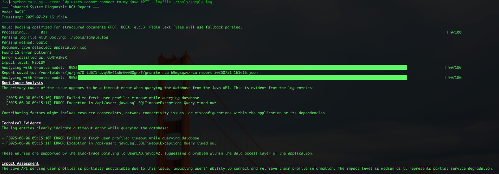
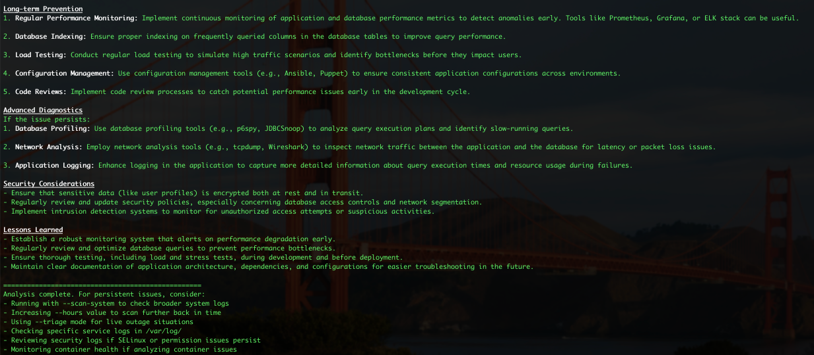

# GraniteRCA

<div align="center">
    
</div>

<div align="center">

[](https://www.apache.org/licenses/LICENSE-2.0)
[](https://www.python.org/downloads/)
[](https://github.com/DS4SD/docling)
[](https://github.com/i-am-bee/beeai)
[](https://github.com/rockenman1234/GraniteRCA)
[](https://github.com/rockenman1234/GraniteRCA)
[](https://github.com/rockenman1234/GraniteRCA/issues)

**A powerful system diagnostic tool that performs comprehensive root cause analysis on Linux systems using AI-powered diagnostics and intelligent document parsing.**

[Quick Start](#installation) •
[Documentation](#usage) •
[Examples](#examples) •
[Contributing](/docs/CONTRIBUTING.md) •
[Report Bug](https://github.com/rockenman1234/GraniteRCA/issues) •
[Request Feature](https://github.com/rockenman1234/GraniteRCA/issues)

</div>

---

## Features

<div align="center">

| **Document Parsing** | **Multi-Mode Operation** | **Smart Analysis** | **Container Support** |
|:---:|:---:|:---:|:---:|
| Docling-powered parsing | Basic, Scan, Quick, Triage | AI-powered diagnostics | Docker & Podman |
| PDF, DOCX, HTML support | Auto log scanning | Impact assessment | Health monitoring |
| Error pattern detection | Live outage handling | Context-aware scoring | Resource tracking |

</div>

### Enhanced Document Parsing with Docling
- Intelligent document structure recognition for structured formats
- Support for multiple file formats (PDF, DOCX, HTML, MD, CSV, XLSX)
- Enhanced basic parsing with error pattern detection for text/log files
- Advanced text extraction with context preservation
- Automatic error pattern detection for all formats
- Document chunking for large structured files
- Smart format detection with graceful fallback

### Multi-mode Operation
GraniteRCA operates in four distinct modes, each optimized for different diagnostic scenarios:

#### Basic Mode - Targeted Log Analysis
- **Technical Purpose**: Deep analysis of specific log files with maximum parsing accuracy
- **Processing Pipeline**: 
  - Direct file ingestion → Docling structure analysis → Error pattern extraction → AI contextualization
  - Single-threaded processing for maximum accuracy and detailed parsing
- **Resource Usage**: Low system impact, focused file I/O
- **Use Case**: When you have identified a specific log file that needs detailed analysis
- **Example**: `python main.py --error "Database timeout" --logfile /var/log/postgresql.log`

#### System Scan Mode - Comprehensive Log Discovery
- **Technical Purpose**: Automated discovery and analysis of system-wide error patterns
- **Processing Pipeline**:
  - Multi-directory traversal → Time-based filtering → Parallel file processing → Pattern aggregation → Correlation analysis
  - Scans `/var/log/`, `/home/user/.local/share/logs/`, and other standard locations
- **Resource Usage**: Moderate to high I/O, parallel processing threads
- **Intelligence Features**:
  - Automatically detects log rotation patterns
  - Correlates timestamps across multiple log sources
  - Prioritizes error patterns by frequency and severity
- **Use Case**: When you need to understand system-wide issues or don't know which logs contain relevant information
- **Example**: `python main.py --error "System slowdown" --scan-system --hours 24`

#### Quick Analysis Mode - Rapid Diagnostic Assessment
- **Technical Purpose**: Fast root cause hypothesis generation with minimal resource usage
- **Processing Pipeline**:
  - Error description analysis → Pattern matching → Context-free AI analysis → Basic recommendations
  - Bypasses file scanning for immediate response
- **Resource Usage**: Minimal - only AI model inference
- **AI Strategy**: Uses error description and system context without log file analysis
- **Performance**: Sub-30 second analysis time
- **Use Case**: Initial triage, rapid hypothesis generation, or when log access is limited
- **Example**: `python main.py --error "Out of memory in Java application"`

#### Triage Mode - Emergency Response Protocol
- **Technical Purpose**: Optimized for live outage situations requiring immediate actionable insights
- **Processing Pipeline**:
  - Expedited analysis → Critical path identification → Emergency procedure prioritization → Resource monitoring integration
  - Enhanced with real-time system metrics collection
- **Resource Usage**: Variable - adapts based on system load
- **Emergency Features**:
  - Prioritizes Critical and High impact findings
  - Generates immediate fix procedures first
  - Includes system resource monitoring (CPU, memory, disk I/O)
  - Provides emergency rollback procedures when applicable
- **Response Time**: Optimized for <60 second initial recommendations
- **Integration**: Can combine with `--scan-system` for comprehensive emergency analysis
- **Use Cases**: 
  - Production outages requiring immediate response
  - Service degradation events
  - Security incidents requiring rapid assessment
- **Example**: `python main.py --error "Production API down" --triage --scan-system`

#### Mode Comparison Matrix

| Feature | Basic Mode | System Scan | Quick Analysis | Triage Mode |
|---------|------------|-------------|----------------|-------------|
| **Analysis Depth** | Deep | Comprehensive | Surface | Focused |
| **File Processing** | Single file | Multi-directory | None | Conditional |
| **Resource Impact** | Low | Medium-High | Minimal | Variable |
| **Response Time** | 2-5 minutes | 5-15 minutes | <30 seconds | <60 seconds |
| **Log Sources** | Specified file | System-wide | None | System + metrics |
| **AI Context** | File-specific | Cross-correlated | Description-only | Emergency-optimized |
| **Output Priority** | Detailed analysis | Pattern correlation | Quick hypothesis | Immediate actions |
| **Use Case** | Known log file | Unknown source | Fast triage | Live outages |

### Context-aware Impact Scoring
- Automatic impact level assessment (Critical, High, Medium, Low, Info)
- Impact-based diagnostic prioritization
- Service dependency analysis
- Resource usage correlation

### Smart Resource Monitoring
- CPU and memory usage tracking
- Process-level resource analysis
- System load monitoring
- Log bundling and correlation with Docling parsing

### Container Health Monitoring
- Support for both Docker and Podman
- Container resource usage tracking
- Container log analysis
- Container state monitoring

### Enhanced Diagnostics
- AI-powered analysis using Granite model
- Pattern-based error classification with Docling
- System context gathering
- Security policy analysis

### Report Generation
- JSON-formatted reports with Docling metadata
- Lessons learned tracking
- Impact assessment
- Actionable recommendations

## Error Detection Capabilities

<div align="center">

| **System Errors** | **Container Issues** | **Network Problems** |
|:-----|:-----|:-----|
| Linux kernel errors & panics | Docker/Podman failures | Connectivity timeouts |
| SELinux policy violations | Container restart loops | Port binding errors |
| Java/JVM exceptions | Image build failures | DNS resolution issues |
| systemd service failures | Volume mount errors | Firewall blocks |

</div>

### Enhanced Pattern Recognition
- **Format-Aware**: Different parsing strategies for structured vs. unstructured content
- **Context-Sensitive**: Understands document types and applies appropriate analysis
- **Multi-Document**: Correlates findings across different file formats
- **Performance-Optimized**: Intelligent parsing reduces analysis time

## Dependencies

<div align="center">

[](https://python.org)
[](https://github.com/DS4SD/docling)
[](https://github.com/i-am-bee/beeai)

</div>

### Python Dependencies
The tool requires the following Python packages (automatically installed via pip):

| Package | Version | Purpose |
|---------|---------|---------|
| `beeai-framework` | ≥1.0.0 | Framework for AI model interaction |
| `tqdm` | ≥4.65.0 | Progress bar functionality |
| `docling` | ≥2.0.0 | Enhanced document parsing and text extraction |
| `psutil` | ≥5.9.0 | System resource monitoring |
| `docker` | ≥6.1.3 | Container monitoring support |
| `podman` | ≥0.1.0 | Podman container support |
| `python-dateutil` | ≥2.8.2 | Date parsing utilities |

### System Dependencies

<details>
<summary><b>Python Environment (Required)</b></summary>

- Python 3.8 or higher
- pip package manager

</details>

<details>
<summary><b>BeeAI Environment Configured (Required)</b></summary>

- BeeAI should be installed and configured per [BeeAI documentation](https://docs.beeai.dev/introduction/installation)
- For local testing and operation, Ollama should be installed and running on your system
- The Granite model tested was: `granite3.3:8b-beeai`, but you may be able to use other models as well (your mileage may vary).

</details>

<details>
<summary><b>Docling Dependencies (Required)</b></summary>

- **For PDF processing**: poppler-utils, tesseract-ocr
- **For OCR capabilities**: EasyOCR models (auto-downloaded)
- **For table extraction**: TableFormer models (auto-downloaded)

</details>

<details>
<summary><b>System Access (Required)</b></summary>

- Read access to system log directories (typically `/var/log/`)
- Permission to execute system commands for context gathering
- SELinux status checking capability (if you want to analyze SELinux issues)

</details>

## Installation

### Automated Setup (Recommended)

```bash
# Clone the repository
git clone https://github.com/rockenman1234/GraniteRCA.git
cd GraniteRCA

# Run the automated setup script
bash setup.sh
```

<div align="center">
<details>
<summary><b>Manual Installation</b></summary>

**1. Install Python dependencies:**
```bash
pip install -r requirements.txt
```

**2. Install Ollama:**
```bash
# For Linux/macOS
curl https://ollama.ai/install.sh | sh
```
> For Windows - Download from [ollama.ai](https://ollama.ai/download)

**3. Install BeeAI Framework:**
```bash
uv tool install beeai-cli
# Start BeeAI platform
beeai platform start
# Set up BeeAI environment
beeai env setup
# Launch the BeeAI GUI
beeai ui
```

**4. Install Docling system dependencies (optional):**
```bash
# For Ubuntu/Debian
sudo apt-get install poppler-utils tesseract-ocr

# For RHEL/CentOS/Fedora
sudo dnf install poppler-utils tesseract

# For macOS
brew install poppler tesseract
```

**5. Pull the Granite model:**
```bash
ollama pull granite3.3:8b-beeai
```

</details>
</div>

## Supported File Formats

<div align="center">

| **Docling Pipeline** | **GraniteRCA Pipeline** |
|:---|:---|
| 📄 **PDF Documents**: Advanced layout analysis<br>`*.pdf` | 📝 **Log Files**: Pattern detection<br>`*.log`, `*.txt` |
| 🗂️ **Office Docs**: Structure-aware parsing<br>`*.docx`, `*.pptx` | ⚙️ **Config Files**: Plain text analysis<br>`*.conf`, `*.ini`, `*.env` |
| 🌐 **Web Content**: Markup parsing<br>`*.html`, `*.md` | 📑 **System Logs**: Contextual parsing<br>`/var/log/*`, `*.out` |
| 📊 **Structured Data**: Table extraction<br>`*.csv`, `*.xlsx` |  |

</div>

### How It Works
- **Smart Detection**: After you input your query, GraniteRCA automatically detects the file format and applies the appropriate parsing strategy:
  - **Docling** for structured documents (PDF, DOCX, HTML)
  - **Enhanced Basic Parsing** for text files (logs, configs)
- **Universal Patterns**: Both pipelines share a common error pattern detection engine, allowing for consistent analysis across all formats.
- **Failsafe**: The main pipeline has a fallback mechanism to ensure that if a file cannot be parsed by Docling, it will still be processed using the basic parsing engine.

---

## Usage

All usage modes now benefit from enhanced document parsing when Docling is available:

> [!NOTE] 
> All usage examples below have been verified and tested with the current version of GraniteRCA.

### Basic Mode (Enhanced with Docling)
Analyze specific log files with detailed parsing:
```bash
python main.py --error "Error description" --logfile /path/to/logfile
```

### System Scan Mode (with intelligent log parsing)
Automatically scan system logs for recent errors:
```bash
python main.py --error "Error description" --scan-system --hours 24
```

### Quick Analysis Mode
Rapid analysis with error description only:
```bash
python main.py --error "Error description"
```

### Triage Mode (for live outages)
Emergency mode for live outage situations:
```bash
python main.py --error "Error description" --triage
```

**Triage mode with system scanning:**
```bash
python main.py --error "Error description" --triage --scan-system
```

### Using Offline Models (for air-gapped environments)
```bash
export DOCLING_ARTIFACTS_PATH="/path/to/models"
python main.py --error "Error description" --scan-system
```

### Docling Configuration Testing (validate your setup)
```bash
# Test Docling parsing with a log file
python tools/docling_test.py --file /var/log/syslog

# Test parsing a remote PDF document
python tools/docling_test.py --url https://arxiv.org/pdf/2408.09869

# Run configuration tests with sample data
python tools/docling_test.py --test-parsing

# Use Docling CLI directly (if installed)
docling /path/to/document.pdf
docling --pipeline vlm --vlm-model smoldocling https://example.com/doc.pdf
```

---

## Options

| Option | Description | Example |
|--------|-------------|---------|
| `--error TEXT` | Description of the error *(required)* | `--error "Database timeout"` |
| `--logfile PATH` | Path to specific log file to analyze | `--logfile /var/log/syslog` |
| `--scan-system` | Automatically scan system logs for recent errors | `--scan-system` |
| `--hours N` | Hours back to scan for errors *(default: 24)* | `--hours 48` |
| `--triage` | Run in triage mode for live outages | `--triage` |
| `--help, -h` | Show help message and usage information | `--help` |
| `--license, -l` | Show license information | `--license` |

> **All examples above have been verified and tested to work correctly with the current version of GraniteRCA.**

### Configuration Testing Options (tools/docling_test.py)

| Option | Description | Example |
|--------|-------------|---------|
| `--file PATH` | Test parsing a local file | `--file /var/log/syslog` |
| `--url URL` | Test parsing a remote document | `--url https://example.com/doc.pdf` |
| `--test-parsing` | Run comprehensive configuration tests | `--test-parsing` |

## Architecture

```mermaid
flowchart TB
    %% Input Sources
    subgraph Input ["📥 Input Sources"]
        A1[📄 Log Files]
        A2[📑 PDF Documents]
        A3[🗂️ Office Docs]
        A4[🌐 General Questions]
        A5[🐳 Container Logs]
    end
    
    %% Operation Modes
    subgraph Modes ["🎯 Operation Modes"]
        M1[🔍 Basic Mode]
        M2[🔄 System Scan]
        M3[⚡ Quick Analysis]
        M4[🚨 Triage Mode]
    end
    
    %% Format Detection Engine
    FD{🧩 Format Detection Engine}
    
    %% Parsing Engines
    subgraph Parsing ["Parsing Engines"]
        P1[🦾 Docling Parser<br/>PDF/DOCX/HTML/CSV]
        P2[🔍 Enhanced Basic Parser<br/>LOG/TXT/CONFIG]
    end
    
    %% System Monitoring
    subgraph Monitor ["📊 System Monitoring"]
        SM1[💾 Resource Monitor]
        SM2[🐳 Container Monitor]
        SM3[🏎️ Performance Metrics]
    end
    
    %% Analysis Pipeline
    subgraph Analysis ["🧠 Analysis Pipeline"]
        AN1[🗂️ Structured Analysis]
        AN2[🔍 Pattern Detection]
        AN3[🔗 Cross-Correlation]
        AN4[📊 Impact Assessment]
    end
    
    %% AI Processing
    subgraph AI ["🤖 AI Processing"]
        AI1[🐝 BeeAI Framework]
        AI2[🧩 Granite LLM]
        AI3[🎯 Context Building]
    end
    
    %% Output Generation
    subgraph Output ["📋 Output Generation"]
        O1[📊 Saved JSON Report]
        O2[🎯 Impact Scoring]
        O3[💡 Recommendations]
        O4[🔄 Lessons Learned]
    end
    
    %% Flow Connections
    Input --> FD
    Modes --> FD
    
    FD -->|Structured Formats| P1
    FD -->|Text/Log Formats| P2
    
    P1 --> AN1
    P2 --> AN2
    
    Monitor --> AN3
    AN1 --> AN3
    AN2 --> AN3
    AN3 --> AN4
    
    AN4 --> AI3
    AI3 --> AI1
    AI1 --> AI2
    AI2 --> Output
    
    %% Styling
    classDef inputClass fill:#e1f5fe,stroke:#0277bd,stroke-width:2px
    classDef modeClass fill:#f3e5f5,stroke:#7b1fa2,stroke-width:2px
    classDef parseClass fill:#e8f5e8,stroke:#2e7d32,stroke-width:2px
    classDef monitorClass fill:#fff3e0,stroke:#ef6c00,stroke-width:2px
    classDef analysisClass fill:#fce4ec,stroke:#c2185b,stroke-width:2px
    classDef aiClass fill:#e3f2fd,stroke:#1976d2,stroke-width:2px
    classDef outputClass fill:#f1f8e9,stroke:#558b2f,stroke-width:2px
    
    class A1,A2,A3,A4,A5 inputClass
    class M1,M2,M3,M4 modeClass
    class P1,P2 parseClass
    class SM1,SM2,SM3 monitorClass
    class AN1,AN2,AN3,AN4 analysisClass
    class AI1,AI2,AI3 aiClass
    class O1,O2,O3,O4 outputClass
```

<div align="center">



</div>

### Project Structure

```
📁 GraniteRCA/
├── 🐍 main.py                   # Main entry point
├── 📄 LICENSE.md                # License details
├── 📦 requirements.txt          # Python Dependencies
├── 📘 README.md                 # This file
├── 📂 src/                      # Core source code
│   ├── 🧑‍💻 rca_agent.py          # CLI interface & argument parsing
│   ├── 🧠 rca_core.py           # Core RCA engine
│   ├── 🛠️ rca_utils.py          # Utility functions
│   ├── 📑 docling_utils.py      # Document parsing integration
│   ├── 📊 resource_monitor.py   # System monitoring
│   └── 🐳 container_monitor.py  # Container support
├── 📚 docs/                     # Documentation
│   └── 🤝 CONTRIBUTING.md       # Contribution guidelines
└── 🧰 tools/                    # Utilities & testing
    ├── 🧪 docling_test.py       # Configuration testing utility
    ├── ⚙️ setup.sh              # Installation script
    └── 📜 sample.log            # Sample log file
```

### Core Components

| Module | Purpose | Docling Integration |
|:-------|:--------|:-------------------|
| **src/rca_agent.py** | Main CLI interface | Auto-format detection |
| **src/rca_core.py** | Core RCA engine | Enhanced log scanning |
| **src/rca_utils.py** | Utility functions | Prompt building |
| **src/resource_monitor.py** | System monitoring | Log bundling |
| **src/container_monitor.py** | Container support | Docker log parsing |
| **src/docling_utils.py** | Document parsing | Core integration |
| **tools/docling_test.py** | Configuration testing | Validation utility |

---

## Examples

### Database Connection Timeout
Analyze database-related issues with automatic system scanning:
```bash
python main.py --error "Database connection timeout after 30 seconds" --scan-system --hours 6
```

**Enhanced Output with Docling:**
- Parses structured config files with layout awareness
- Correlates error patterns across multiple document types
- Provides detailed timeline analysis

### Container Crash Analysis
Investigate container failures with specific log analysis:
```bash
python main.py --error "Container app-frontend crashed with exit code 1" --logfile /var/log/messages --triage
```

**Enhanced Features:**
- Advanced parsing of Docker structured logs
- Cross-references with application documentation (if available)
- Intelligent error categorization

### System Performance Analysis
Diagnose system-wide performance issues:
```bash
python main.py --error "High CPU usage and slow response" --scan-system
```

**Enhanced Output with Docling:**
- Parses structured config files with layout awareness
- Correlates error patterns across multiple document types
- Provides detailed timeline analysis

### Emergency Triage Mode
For critical live outages requiring immediate attention:
```bash
python main.py --error "Critical service outage - users cannot access application" --triage --scan-system
```

**Triage Features:**
- Prioritizes critical issues for immediate response
- Fast analysis mode for emergency situations
- Comprehensive system scanning for root cause identification

### Application Log Analysis
Analyze specific application log files for errors:
```bash
python main.py --error "Java application throwing NullPointerException" --logfile /var/log/tomcat/catalina.out
```

### Security Policy Analysis
Investigate SELinux or security-related issues:
```bash
python main.py --error "Permission denied accessing /var/lib/mysql" --scan-system --hours 12
```

### Historical Analysis
Analyze issues from further back in time:
```bash
python main.py --error "Intermittent network connectivity issues" --scan-system --hours 72
```

### Quick Diagnosis
Fast analysis when you only have an error description:
```bash
python main.py --error "Out of memory error in web application"
```

---
## TODO: Features Coming Soon

<div align="center">

| Feature | Description | Status |
|:--------|:------------|:------:|
| **CI/CD Integration** | Automated sanity checks in pipelines | ⏳ |
| **`granite-io` Framework Support** | Integration with `granite-io` as an alternative LLM backend | ⏳ |
| **TUI Interface** | Text-based user interface for easier interaction, configuration, and debugging | ⏳ |

</div>

---

## Contributing

We always welcome contributions! Please read our [Contributing Guide](docs/CONTRIBUTING.md) for details on how to get started.

---

## Screenshots

- Below are screenshots from the following query: `python main.py --error "My users cannot connect to my java API" --logfile ./tools/sample.log`

<div align="center">
    
    
    
</div>


---

<div align="center">

**Made with ❤️ for System Administrators and DevOps Engineers**

</div>
