# 🔍 GraniteRCA

<div align="center">

</div>

#### Enhanced System Diagnostic Root Cause Analysis Tool with Docling, BeeAI, & IBM Granite

<div align="center">

[](https://www.gnu.org/licenses/lgpl-3.0)
[](https://www.python.org/downloads/)
[](https://github.com/DS4SD/docling)
[](https://github.com/i-am-bee/beeai)
[](https://github.com/rockenman1234/GraniteRCA)
[](https://github.com/rockenman1234/GraniteRCA)
[](https://github.com/rockenman1234/GraniteRCA/issues)

**A powerful system diagnostic tool that performs comprehensive root cause analysis on Linux systems using AI-powered diagnostics and intelligent document parsing.**

[🚀 Quick Start](#-installation) •
[📖 Documentation](#-usage) •
[🎯 Examples](#-examples) •
[🤝 Contributing](/docs/CONTRIBUTING.md) •
[🐛 Report Bug](https://github.com/rockenman1234/GraniteRCA/issues) •
[💡 Request Feature](https://github.com/rockenman1234/GraniteRCA/issues)

</div>

---

## ✨ Features

<div align="center">

| 🔧 **Document Parsing** | 🔄 **Multi-Mode Operation** | 📊 **Smart Analysis** | 🐳 **Container Support** |
|:---:|:---:|:---:|:---:|
| Docling-powered parsing | Basic, Scan, Quick, Triage | AI-powered diagnostics | Docker & Podman |
| PDF, DOCX, HTML support | Auto log scanning | Impact assessment | Health monitoring |
| Error pattern detection | Live outage handling | Context-aware scoring | Resource tracking |

</div>

### 🔍 **Enhanced Document Parsing with Docling**
- ✅ Intelligent document structure recognition for structured formats
- ✅ Support for multiple file formats (PDF, DOCX, HTML, MD, CSV, XLSX)
- ✅ Enhanced basic parsing with error pattern detection for text/log files
- ✅ Advanced text extraction with context preservation
- ✅ Automatic error pattern detection for all formats
- ✅ Document chunking for large structured files
- ✅ Smart format detection with graceful fallback

### 🔄 **Multi-mode Operation**
GraniteRCA operates in four distinct modes, each optimized for different diagnostic scenarios:

#### 🎯 **Basic Mode** - Targeted Log Analysis
- **Technical Purpose**: Deep analysis of specific log files with maximum parsing accuracy
- **Processing Pipeline**: 
  - Direct file ingestion → Docling structure analysis → Error pattern extraction → AI contextualization
  - Single-threaded processing for maximum accuracy and detailed parsing
- **Resource Usage**: Low system impact, focused file I/O
- **Use Case**: When you have identified a specific log file that needs detailed analysis
- **Example**: `python main.py --error "Database timeout" --logfile /var/log/postgresql.log`

#### 🔍 **System Scan Mode** - Comprehensive Log Discovery
- **Technical Purpose**: Automated discovery and analysis of system-wide error patterns
- **Processing Pipeline**:
  - Multi-directory traversal → Time-based filtering → Parallel file processing → Pattern aggregation → Correlation analysis
  - Scans `/var/log/`, `/home/user/.local/share/logs/`, and other standard locations
- **Resource Usage**: Moderate to high I/O, parallel processing threads
- **Intelligence Features**:
  - Automatically detects log rotation patterns
  - Correlates timestamps across multiple log sources
  - Prioritizes error patterns by frequency and severity
- **Use Case**: When you need to understand system-wide issues or don't know which logs contain relevant information
- **Example**: `python main.py --error "System slowdown" --scan-system --hours 24`

#### ⚡ **Quick Analysis Mode** - Rapid Diagnostic Assessment
- **Technical Purpose**: Fast root cause hypothesis generation with minimal resource usage
- **Processing Pipeline**:
  - Error description analysis → Pattern matching → Context-free AI analysis → Basic recommendations
  - Bypasses file scanning for immediate response
- **Resource Usage**: Minimal - only AI model inference
- **AI Strategy**: Uses error description and system context without log file analysis
- **Performance**: Sub-30 second analysis time
- **Use Case**: Initial triage, rapid hypothesis generation, or when log access is limited
- **Example**: `python main.py --error "Out of memory in Java application"`

#### 🚨 **Triage Mode** - Emergency Response Protocol
- **Technical Purpose**: Optimized for live outage situations requiring immediate actionable insights
- **Processing Pipeline**:
  - Expedited analysis → Critical path identification → Emergency procedure prioritization → Resource monitoring integration
  - Enhanced with real-time system metrics collection
- **Resource Usage**: Variable - adapts based on system load
- **Emergency Features**:
  - Prioritizes Critical and High impact findings
  - Generates immediate fix procedures first
  - Includes system resource monitoring (CPU, memory, disk I/O)
  - Provides emergency rollback procedures when applicable
- **Response Time**: Optimized for <60 second initial recommendations
- **Integration**: Can combine with `--scan-system` for comprehensive emergency analysis
- **Use Cases**: 
  - Production outages requiring immediate response
  - Service degradation events
  - Security incidents requiring rapid assessment
- **Example**: `python main.py --error "Production API down" --triage --scan-system`

#### 📊 **Mode Comparison Matrix**

| Feature | Basic Mode | System Scan | Quick Analysis | Triage Mode |
|---------|------------|-------------|----------------|-------------|
| **Analysis Depth** | Deep | Comprehensive | Surface | Focused |
| **File Processing** | Single file | Multi-directory | None | Conditional |
| **Resource Impact** | Low | Medium-High | Minimal | Variable |
| **Response Time** | 2-5 minutes | 5-15 minutes | <30 seconds | <60 seconds |
| **Log Sources** | Specified file | System-wide | None | System + metrics |
| **AI Context** | File-specific | Cross-correlated | Description-only | Emergency-optimized |
| **Output Priority** | Detailed analysis | Pattern correlation | Quick hypothesis | Immediate actions |
| **Use Case** | Known log file | Unknown source | Fast triage | Live outages |

### 📊 **Context-aware Impact Scoring**
- 🔴 Automatic impact level assessment (Critical, High, Medium, Low, Info)
- 📈 Impact-based diagnostic prioritization
- 🔗 Service dependency analysis
- 📊 Resource usage correlation

### 🖥️ **Smart Resource Monitoring**
- 💻 CPU and memory usage tracking
- 🔄 Process-level resource analysis
- 📊 System load monitoring
- 📦 Log bundling and correlation with Docling parsing

### 🐳 **Container Health Monitoring**
- 🐳 Support for both Docker and Podman
- 📊 Container resource usage tracking
- 📋 Container log analysis
- 🔍 Container state monitoring

### 🧠 **Enhanced Diagnostics**
- 🤖 AI-powered analysis using Granite model
- 🔍 Pattern-based error classification with Docling
- 🖥️ System context gathering
- 🔒 Security policy analysis

### 📄 **Report Generation**
- 📊 JSON-formatted reports with Docling metadata
- 📚 Lessons learned tracking
- 🎯 Impact assessment
- ✅ Actionable recommendations

## 🎯 **Error Detection Capabilities**

<div align="center">

| 🖥️ **System Errors** | 🐳 **Container Issues** | 🔗 **Network Problems** |
|:-----|:-----|:-----|
| 🚨 Linux kernel errors & panics | 📦 Docker/Podman failures | 🌐 Connectivity timeouts |
| 🔒 SELinux policy violations | 🔄 Container restart loops | 🔌 Port binding errors |
| ☕ Java/JVM exceptions | 🏗️ Image build failures | 🚦 DNS resolution issues |
| ⚙️ systemd service failures | 💾 Volume mount errors | 🛡️ Firewall blocks |

</div>

### 🧠 **Enhanced Pattern Recognition**
- ✅ **Format-Aware**: Different parsing strategies for structured vs. unstructured content
- 🎯 **Context-Sensitive**: Understands document types and applies appropriate analysis
- 🔍 **Multi-Document**: Correlates findings across different file formats
- 🚀 **Performance-Optimized**: Intelligent parsing reduces analysis time

## 📋 Dependencies

<div align="center">

[](https://python.org)
[](https://github.com/DS4SD/docling)
[](https://github.com/i-am-bee/beeai)
[](https://ollama.ai)

</div>

### 🐍 **Python Dependencies**
The tool requires the following Python packages (automatically installed via pip):

| Package | Version | Purpose |
|---------|---------|---------|
| `beeai-framework` | ≥1.0.0 | 🤖 Framework for AI model interaction |
| `tqdm` | ≥4.65.0 | 📊 Progress bar functionality |
| `docling` | ≥2.0.0 | 📄 Enhanced document parsing and text extraction |
| `psutil` | ≥5.9.0 | 💻 System resource monitoring |
| `docker` | ≥6.1.3 | 🐳 Container monitoring support |
| `podman` | ≥0.1.0 | 🐳 Podman container support |
| `python-dateutil` | ≥2.8.2 | 📅 Date parsing utilities |

### 🖥️ **System Dependencies**

<details>
<summary><b>🐍 Python Environment (Required)</b></summary>

- Python 3.8 or higher
- pip package manager

</details>

<details>
<summary><b>🤖 Ollama (Required)</b></summary>

- Ollama installed and running
- Granite model available: `granite3.3:8b-beeai`

</details>

<details>
<summary><b>📄 Docling Dependencies (Optional - for enhanced parsing)</b></summary>

- **For PDF processing**: poppler-utils, tesseract-ocr
- **For OCR capabilities**: EasyOCR models (auto-downloaded)
- **For table extraction**: TableFormer models (auto-downloaded)

</details>

<details>
<summary><b>🔐 System Access (Required)</b></summary>

- Read access to system log directories (typically `/var/log/`)
- Permission to execute system commands for context gathering
- SELinux status checking capability (if analyzing SELinux issues)

</details>

## 🚀 Installation

<div align="center">

[](https://github.com/rockenman1234/GraniteRCA#automated-setup)
[](https://github.com/rockenman1234/GraniteRCA#manual-installation)

</div>

### 🤖 **Automated Setup** (Recommended)

```bash
# Clone the repository
git clone https://github.com/rockenman1234/GraniteRCA.git
cd GraniteRCA

# Run the automated setup script
bash setup.sh
```

<div align="center">
<details>
<summary><b>🔧 Manual Installation</b></summary>

**1. Install Python dependencies:**
```bash
pip install -r requirements.txt
```

**2. Install Ollama:**
```bash
# For Linux/macOS
curl https://ollama.ai/install.sh | sh
```
> For Windows - Download from [ollama.ai](https://ollama.ai/download)

**3. Install BeeAI Framework:**
```bash
brew install i-am-bee/beeai/beeai
beeai platform start
beeai env setup
```

**4. Install Docling system dependencies (optional):**
```bash
# For Ubuntu/Debian
sudo apt-get install poppler-utils tesseract-ocr

# For RHEL/CentOS/Fedora
sudo dnf install poppler-utils tesseract

# For macOS
brew install poppler tesseract
```

**5. Download Docling models for offline usage (optional):**
```bash
docling-tools models download
```

**6. Set environment variables (optional):**
```bash
# For offline model usage
export DOCLING_ARTIFACTS_PATH="/path/to/models"

# For limiting CPU usage
export OMP_NUM_THREADS=4
```

**7. Verify installation:**
```bash
# Test log directory access
ls -l /var/log/

# Test system command execution
uname -a
```

</details>
</div>

## 📄 Supported File Formats

<div align="center">

| 🔧 **Docling Enhanced** | 📝 **Enhanced Basic** |
|:---|:---|
| 📕 **PDF Documents**: Advanced layout analysis | 📄 **Log Files**: .log, .txt with pattern detection |
| 📊 **Office Docs**: .docx, .pptx with structure | ⚙️ **Config Files**: Plain text with analysis |
| 🌐 **Web Content**: .html, .md with markup | 🖥️ **System Logs**: Enhanced parsing + context |
| 📋 **Structured Data**: .csv, .xlsx with tables | |

</div>

### 🧠 **How It Works**
- 🔍 **Smart Detection**: Automatically detects file formats
- 🚀 **Dual Processing**: Structured docs use Docling, text files use enhanced basic parsing  
- 🎯 **Universal Patterns**: Both methods include intelligent error categorization
- 🛡️ **Failsafe**: Graceful fallback ensures no parsing failures

---

## 🎮 Usage

<div align="center">

[](#basic-mode-enhanced-with-docling)
[](#system-scan-mode-with-intelligent-log-parsing)
[](#quick-analysis-mode)
[](#triage-mode-for-live-outages)

</div>

All usage modes now benefit from enhanced document parsing when Docling is available:

> **📋 Note:** All usage examples below have been verified and tested with the current version of GraniteRCA.

### 📄 **Basic Mode (Enhanced with Docling)**
Analyze specific log files with detailed parsing:
```bash
python main.py --error "Error description" --logfile /path/to/logfile
```

### 🔍 **System Scan Mode (with intelligent log parsing)**
Automatically scan system logs for recent errors:
```bash
python main.py --error "Error description" --scan-system --hours 24
```

### ⚡ **Quick Analysis Mode**
Rapid analysis with error description only:
```bash
python main.py --error "Error description"
```

### 🚨 **Triage Mode (for live outages)**
Emergency mode for live outage situations:
```bash
python main.py --error "Error description" --triage
```

**Triage mode with system scanning:**
```bash
python main.py --error "Error description" --triage --scan-system
```

### 🔒 **Using Offline Models (for air-gapped environments)**
```bash
export DOCLING_ARTIFACTS_PATH="/path/to/models"
python main.py --error "Error description" --scan-system
```

### 🧪 **Docling Configuration Testing (validate your setup)**
```bash
# Test Docling parsing with a log file
python tools/docling_test.py --file /var/log/syslog

# Test parsing a remote PDF document
python tools/docling_test.py --url https://arxiv.org/pdf/2408.09869

# Run configuration tests with sample data
python tools/docling_test.py --test-parsing

# Use Docling CLI directly (if installed)
docling /path/to/document.pdf
docling --pipeline vlm --vlm-model smoldocling https://example.com/doc.pdf
```

---

## 🎛️ Options

| Option | Description | Example |
|--------|-------------|---------|
| `--error TEXT` | 🔍 Description of the error *(required)* | `--error "Database timeout"` |
| `--logfile PATH` | 📄 Path to specific log file to analyze | `--logfile /var/log/syslog` |
| `--scan-system` | 🔍 Automatically scan system logs for recent errors | `--scan-system` |
| `--hours N` | ⏰ Hours back to scan for errors *(default: 24)* | `--hours 48` |
| `--triage` | 🚨 Run in triage mode for live outages | `--triage` |
| `--help, -h` | 📚 Show help message and usage information | `--help` |
| `--license, -l` | ⚖️ Show license information | `--license` |

> **✅ All examples above have been verified and tested to work correctly with the current version of GraniteRCA.**

### 🧪 **Configuration Testing Options** (tools/docling_test.py)

| Option | Description | Example |
|--------|-------------|---------|
| `--file PATH` | 🧪 Test parsing a local file | `--file /var/log/syslog` |
| `--url URL` | 🌐 Test parsing a remote document | `--url https://example.com/doc.pdf` |
| `--test-parsing` | 🔬 Run comprehensive configuration tests | `--test-parsing` |

## 🏗️ Architecture

```mermaid
graph TB
    A[📄 Document Input] --> B{🔍 Format Detection}
    B -->|PDF/DOCX/HTML| C[⚡ Docling Parser]
    B -->|LOG/TXT| D[🧠 Enhanced Basic Parser]
    C --> E[📊 Structured Analysis]
    D --> F[🎯 Pattern Detection]
    E --> G[🤖 AI Analysis]
    F --> G
    G --> H[📋 RCA Report]
```

<div align="center">



</div>

### 📁 **Project Structure**

```
GraniteRCA/
├── 📄 main.py                  # Main entry point
├── 📜 LICENSE.md               # License details
├── 📄 requirements.txt         # Python Dependencies
├── 📖 README.md                # This file
├── 📂 src/                     # Core source code
│   ├── 🤖 rca_agent.py         # CLI interface & argument parsing
│   ├── 🔧 rca_core.py          # Core RCA engine
│   ├── 🛠️ rca_utils.py         # Utility functions
│   ├── 📄 docling_utils.py     # Document parsing integration
│   ├── 📊 resource_monitor.py  # System monitoring
│   └── 🐳 container_monitor.py # Container support
├── 📂 docs/                    # Documentation
│   └── 🤝 CONTRIBUTING.md      # Contribution guidelines
└── 📂 tools/                   # Utilities & testing
    ├── 🧪 docling_test.py      # Configuration testing utility
    ├── ⚙️ setup.sh             # Installation script
    └── 📋 sample.log           # Sample log file
```

### 🧩 **Core Components**

| Module | Purpose | Docling Integration |
|:-------|:--------|:-------------------|
| 🤖 **src/rca_agent.py** | Main CLI interface | ✅ Auto-format detection |
| 🔧 **src/rca_core.py** | Core RCA engine | ✅ Enhanced log scanning |
| 🛠️ **src/rca_utils.py** | Utility functions | ✅ Prompt building |
| 📊 **src/resource_monitor.py** | System monitoring | ✅ Log bundling |
| 🐳 **src/container_monitor.py** | Container support | ✅ Docker log parsing |
| 📄 **src/docling_utils.py** | Document parsing | ✅ Core integration |
| 🧪 **tools/docling_test.py** | Configuration testing | ✅ Validation utility |

---

## 🎯 Examples

<div align="center">

[](#database-connection-timeout)
[](#container-crash-analysis)
[](#system-performance-analysis)
[](#emergency-triage-mode)

</div>

### 📊 **Database Connection Timeout**
Analyze database-related issues with automatic system scanning:
```bash
python main.py --error "Database connection timeout after 30 seconds" --scan-system --hours 6
```

**✅ Enhanced Output with Docling:**
- 📄 Parses structured config files with layout awareness
- 🔍 Correlates error patterns across multiple document types
- 📊 Provides detailed timeline analysis

### 🐳 **Container Crash Analysis**
Investigate container failures with specific log analysis:
```bash
python main.py --error "Container app-frontend crashed with exit code 1" --logfile /var/log/messages --triage
```

**✅ Enhanced Features:**
- 🏗️ Advanced parsing of Docker structured logs
- 📋 Cross-references with application documentation (if available)
- 🎯 Intelligent error categorization

### ⚙️ **System Performance Analysis**
Diagnose system-wide performance issues:
```bash
python main.py --error "High CPU usage and slow response" --scan-system
```

**✅ Enhanced Output with Docling:**
- 📄 Parses structured config files with layout awareness
- 🔍 Correlates error patterns across multiple document types
- 📊 Provides detailed timeline analysis

### 🚨 **Emergency Triage Mode**
For critical live outages requiring immediate attention:
```bash
python main.py --error "Critical service outage - users cannot access application" --triage --scan-system
```

**✅ Triage Features:**
- 🚨 Prioritizes critical issues for immediate response
- ⚡ Fast analysis mode for emergency situations
- 📊 Comprehensive system scanning for root cause identification

### 📝 **Application Log Analysis**
Analyze specific application log files for errors:
```bash
python main.py --error "Java application throwing NullPointerException" --logfile /var/log/tomcat/catalina.out
```

### 🔒 **Security Policy Analysis**
Investigate SELinux or security-related issues:
```bash
python main.py --error "Permission denied accessing /var/lib/mysql" --scan-system --hours 12
```

### 🕐 **Historical Analysis**
Analyze issues from further back in time:
```bash
python main.py --error "Intermittent network connectivity issues" --scan-system --hours 72
```

### ⚡ **Quick Diagnosis**
Fast analysis when you only have an error description:
```bash
python main.py --error "Out of memory error in web application"
```

---

<div align="center">

**Made with ❤️ for System Administrators and DevOps Engineers**

</div>
